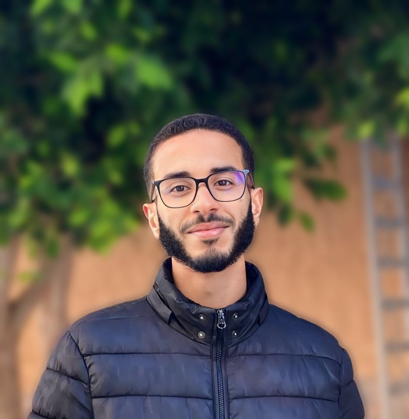

# ASalaam Alaykoom. Welcome to Ali Harit's GitHub Profile

  

 

I'm Ali Harit, a second-year Software Engineering student at the National School of Applied Sciences of Khouribga (ENSA). I'm passionate about computer science and have acquired solid programming skills through my studies and personal projects. I'm also experienced in web development and familiar with various programming languages and tools.

 
  

##  Skills

### Programming Languages
- Java SE
- Python
- C/C++
- HTML, CSS, JavaScript
- PHP

### Web Development
- MySQL
- MongoDB

### Frameworks and Libraries
- Laravel
- JavaFX
- React JS
- Node JS
- SCSS
- JQuery
- Bootstrap
- Tailwind CSS

